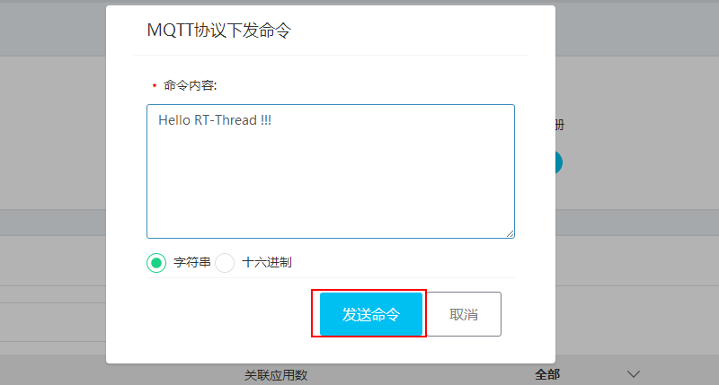
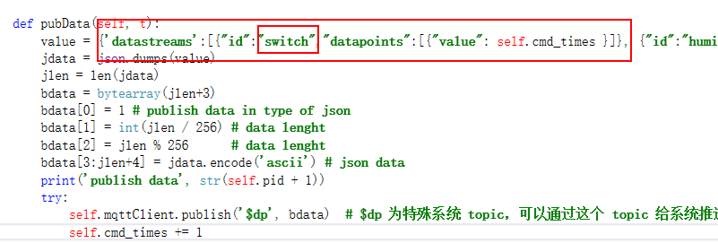
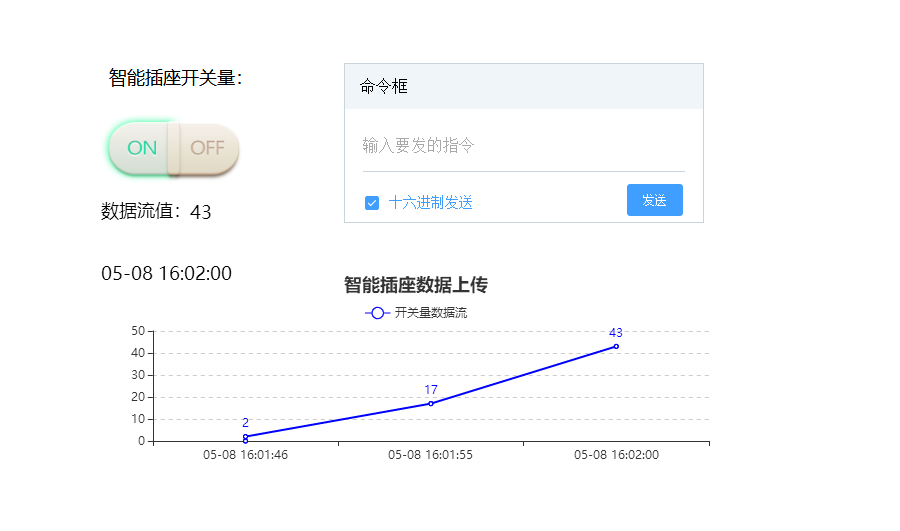

## 云平台对接(OneNET)

!!! abstract "简介"
    本节介绍如何使用 RT-Thread MicroPython 来将设备接入 OneNET 云平台，本次示例使用的接入协议为 MQTT。

## 准备工作

- 首先需要安装 `urequests`  模块和 `umqtt.simple` 模块，安装方法参考前面第二节和第四节。
- 本章实例代码在最后一节的附录中，可以修改后复制到 main.py 文件中在 MSH 中使用 python 命令来执行。

## 产品创建

- 想要将开发板接入 OneNET 云平台，首先要进行产品的创建，创建分为两步，第一步是注册一个用户账号，第二步是创建一个基于特定协议的产品。

### 用户注册

- 为了使用 OneNET 设备云的强大功能，首先要在 OneNET 上[注册开发者账号](https://open.iot.10086.cn/doc/art436.html#104)，来创建专属的“开发者中心 。

### 产品创建

- 接下来需要在 OneNET 平台上[创建产品](https://open.iot.10086.cn/doc/art437.html#104)。这里要注意的是在最后选择`设备接入方式`和`设备接入协议时`，因为本次示例使用的是 MQTT 协议，所以要在设备接入方式中选择`公开协议`，设备接入协议选择 `MQTT`。


## 硬件接入

本章节将介绍如何将设备接入到 OneNET 云平台上。并且演示一个云平台向设备发送命令，设备向云平台返回命令发送次数的示例。

### 设备的注册和接入

- 成功创建设备之后，将得到的产品 ID 记录下来供后面推送数据使用。


- 将设备的`正式环境注册码`记录下来用于注册新的设备。


- 接下来打开例程中的 main.py，修改 sn 为设备唯一标识码，product_id 为上面得到的6位产品 ID，regKey 为上面记录下来的正式环境注册码。


- 在开发板中运行 main.py 即可在 OneNET 上看到我们注册的设备。


- 名为 `DeviceRT_Thread_Test_Product` 的设备已经注册完毕并且上线。


### 云平台向设备发送命令

- 可以通过发送命令功能来给开发板发送几组命令。




- 可以在设备端看到云平台下发的数据，同时设备端会上传命令发送次数的数据


### 设备向云平台上传数据

- 点击数据流管理功能来查看设备端上传的数据


- 可以在数据流管理中看到设备端上传的的命令发送次数 switch


- 这里的 switch 数据是在 mqtt.py 的 pubData 函数里面修改的，可以通过 value 对象的内容来给云平台上传不同的数据。



- 至此设备和 OneNET 云平台就对接好了。

### 添加独立应用

- 为了方便使用还可以给设备[添加独立的应用](https://open.iot.10086.cn/doc/art461.html#108)，效果如下图：



## 代码讲解

- 通过修改 value 对象来修改向服务器发送的数据，这里是发送到特殊的系统 topic `$dp`


- 给服务器发送数据的触发条件是收到服务器下发的命令，这样就没有保证会一直有数据发送到服务器，所以在没有数据交换的一段时间后，MQTT 连接有可能断开。后面可以修改为在定时器中断中周期性的给服务器发送数据，这样就能保持连接不断开。


### 附录示例代码

```python
import urequests as requests
from umqtt.simple import MQTTClient
import ujson as json
import time

class Register():
    def __init__(self, url='', title='', sn='', mac=''):
        self.url = url
        self.title = title
        self.sn = sn
        self.mac = mac
        self.sock = None
        self.tjson = {}
        self.erron = 0
        self.key = ''
        self.device_id = ''

    def regist(self):
        assert self.url is not None, "Url is not set"
        _, _, host, path = self.url.split('/', 3)
        if host == '':
            return
        device = {"mac":self.mac} if self.sn == '' else {"sn":self.sn}
        if self.title != '':
            device['title'] = self.title
        jdata = json.dumps(device)

        resp = requests.post(self.url, data=jdata)
        if resp:
            self.tjson = resp.json()
            if self.tjson['errno'] == 0:
                self.key = self.tjson['data']['key']
                self.device_id = self.tjson['data']['device_id']
            return 0
        else:
            return -1

class OneNetMqtt:
    failed_count = 0

    def __init__(self, client_id='', username='', password=''):
        self.server = "183.230.40.39"
        self.client_id = client_id
        self.username = username
        self.password = password
        self.topic = "topic_sub"               # 填入测试 topic
        self.mqttClient = MQTTClient(self.client_id, self.server,6002,self.username,self.password)
        self.cmd_times = 0                      # publish count

    def pubData(self, t):
        value = {'datastreams':[{"id":"switch","datapoints":[{"value": self.cmd_times }]}]}
        jdata = json.dumps(value)
        jlen = len(jdata)
        bdata = bytearray(jlen+3)
        bdata[0] = 1                             # publish data in type of json
        bdata[1] = int(jlen / 256)               # data lenght
        bdata[2] = jlen % 256                    # data lenght
        bdata[3:jlen+4] = jdata.encode('ascii')  # json data
        print('publish data', str(self.cmd_times + 1))
        try:
            self.mqttClient.publish('$dp', bdata)  # $dp 为特殊系统 topic，可以通过这个 topic 给系统推送信息,但是不能订阅这个 topic
            self.cmd_times += 1
            self.failed_count = 0
        except Exception as ex:
            self.failed_count += 1
            print('publish failed:', ex.message())
            if self.failed_count >= 3:
                print('publish failed three times, RT-Thread MicroPython resetting...')
                reset()

    def sub_callback(self, topic, msg):
        print((topic,msg))
        cmd = msg.decode('ascii').split(" ")
        print('sub_callback')

    def connect(self):
        self.mqttClient.set_callback(self.sub_callback)
        self.mqttClient.connect()
        self.mqttClient.subscribe(self.topic)
        print("Connected to %s, subscribed to %s topic." % (self.server, self.topic))
        try:
            while True:
                self.mqttClient.check_msg()
                print("pubdata")
                self.pubData('x')

        finally:
            self.mqttClient.disconnect()
            print('MQTT closed')

def main():
    sn = 'RT_Thread_XXXX_Product'           #1、填入设备唯一标识符
    title = 'Device' + sn 
    product_id = 'XXXXXX'                   #2、填入创建设备时获得的产品 ID
    regKey = 'XXXXXXXXXXXXXXXX'             #3、填入正式环境注册码
    url = 'http://api.heclouds.com/register_de?register_code=' + regKey

    reg = Register(url=url, title=title, sn=sn)      #根据上面的信息注册设备，如果已经注册不再重复注册
    if reg.regist()==0:
        MQTT = OneNetMqtt(client_id=reg.device_id, username=product_id, password=reg.key) #开启 MQTT 服务
        MQTT.connect()
    else:
        print('Error: No Client ID!')

if __name__ == "__main__":
    main()
```